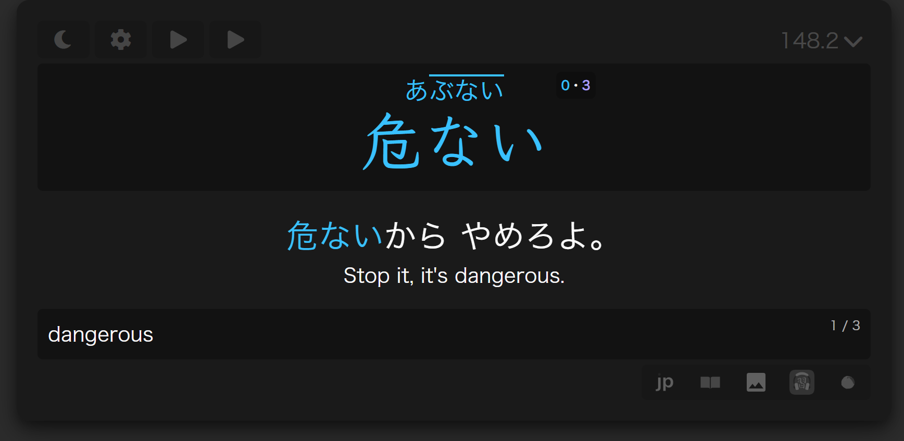

# Manabi Senren

This starter Japanese vocabulary [Anki](https://apps.ankiweb.net/) deck is simply a combination of two fantastic, open-source projects: [Manabi 2.7k](https://github.com/fafner8/Manabi) and [Senren](https://brenoaqua.github.io/Senren/).

Manabi is an Anki deck made to introduce beginners to basic Japanese vocabulary, and Senren is customizable Anki note type for studying Japanese.

## Features

Manabi Senren has all the features of both Manabi and Senren, so go check out their documentation using the links above.

- Most cards have additional glossary entries from Jitendex, as well as monolingual entries and you can [change which of the shows up by default](https://brenoaqua.github.io/Senren/defnition_toggle/).
- Sentence on the front, notes and sentence translation on the back are expanded by default, but this can be changed in the note [preferences](https://brenoaqua.github.io/Senren/Preferences).
- Pitch accents have been added from NHK and 大辞泉 pitch accent dictionaries. 

## Get started

Download the deck [here](https://github.com/StyraxBenzoin/Manabi-Senren/releases/latest), and [import it into Anki](https://docs.ankiweb.net/importing/packaged-decks.html).

## Versions

This version of Manabi-Senren is built with the following versions of Manabi and Senren:

- [Manabi v1.3](https://github.com/fafner8/Manabi/releases/tag/v1.3)
- [Senren v5.1.0](https://github.com/BrenoAqua/Senren/releases/tag/v5.1.0)
