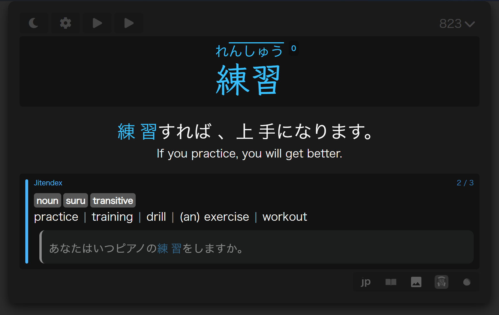

# Manabi Senren

This starter Japanese vocabulary [Anki](https://apps.ankiweb.net/) deck is simply a combination of two fantastic, open-source projects: [Manabi 2.7k](https://github.com/fafner8/Manabi) and [Senren](https://brenoaqua.github.io/Senren/).

Manabi is an Anki deck made to introduce beginners to basic Japanese vocabulary, and Senren is customizable Anki note type for studying Japanese.

## Features

Manabi Senren has all the features of both Manabi and Senren, so go check out their documentation using the links above.

- Most cards have additional glossary entries[^1] from Jitendex, as well as monolingual entries and you can [change which of them shows up by default](https://brenoaqua.github.io/Senren/defnition_toggle/). 
- Japanese sentence on the front by default. Sentence translation on the back is hidden by default (hover to reveal). This can be changed in the note [preferences](https://brenoaqua.github.io/Senren/Preferences).

[^1]: Fair warning the CSS from these glossaries makes for a heavy deck in terms of text size, ~120MB. If later down the line you find yourself hitting the [AnkiWeb limit](https://faqs.ankiweb.net/are-there-limits-on-file-sizes-on-ankiweb.html) or you just want to shrink the size of this deck, you can simply use the [Batch Editing](https://ankiweb.net/shared/info/291119185) add-on to remove the content of the `glossary` field and just keep using the original Manabi `definition`.

## Get started

Download the deck [here](https://github.com/StyraxBenzoin/Manabi-Senren/releases/latest), and [import it into Anki](https://docs.ankiweb.net/importing/packaged-decks.html).

## Versions

This version of Manabi-Senren is built with the following versions of Manabi and Senren:

- [Manabi v1.8.2](https://github.com/fafner8/Manabi/releases/tag/v1.8)
- [Senren v5.1.0](https://github.com/BrenoAqua/Senren/releases/tag/v5.1.0)

## DIY
If you want to convert the deck yourself:
- First download and import [Senren](https://github.com/BrenoAqua/Senren) note type into Anki
- Download [Manabi](https://github.com/fafner8/Manabi) and import to Anki to get the media files in your collection
- Export the Manabi deck with "Notes in Plain Text (.txt)" selecting all checkboxes for inclusions.
- Delete the Manabi deck from Anki (media files will remain in your collection)
- Run `Manabi-Senren.py` on the exported `Manabi.txt` file. `Manabi-Senren.txt` will be created.
- Import `Manabi-Senren.txt` into Anki
- Use [backfill-anki-yomitan](https://github.com/Manhhao/backfill-anki-yomitan) with `Manabi_Backfill.json` from this repo (edit glossary to your desired dictionaries) to fill the missing Senren fields: "glossary" and "frequencies"
- Done
